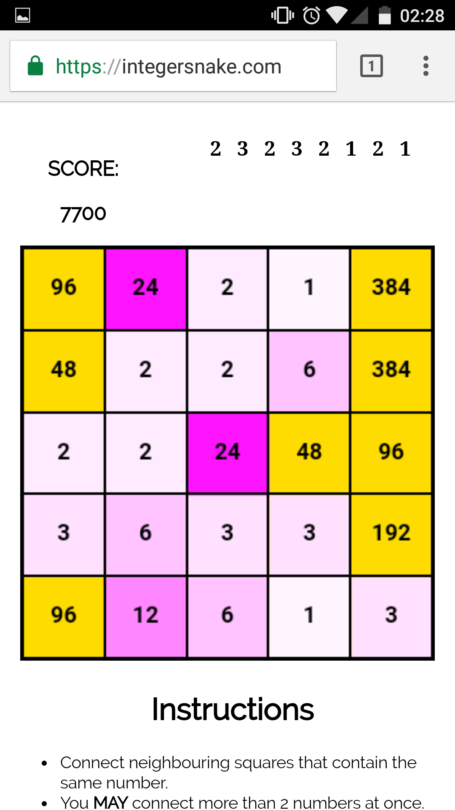

# Integer Snake AI

The goal is write a function that takes a grid as input and returns the most strategic snake as output.

### [Demo](https://thgh.github.io/integersnake-ai/)

## Show the next numbers

Copy the snippet below into the address bar of integersnake.com to see which numbers are coming up next.

```
javascript:!function(){function n(n){var o=[];s=seed;for(var a=0;n>a;a++){s++;var e=1e4*Math.sin(s);e-=Math.floor(e),o.push(Math.ceil(3*e))}return o}function o(){$("#random").html(n(5).join(" &nbsp; "))}$("#game_canvas").before('<b id="random"></b>'),$("body").on("touchend",o),$("body").on("mouseup",o);o()}();
```

It should look like this:



Yes, this was used to get the 10k+ scores
